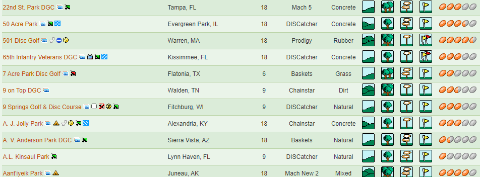
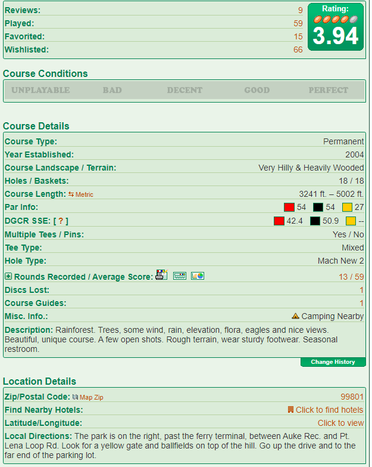
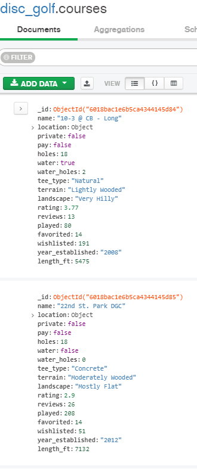
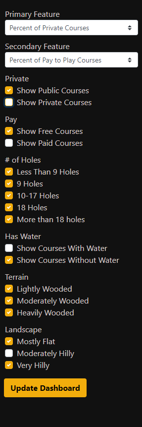
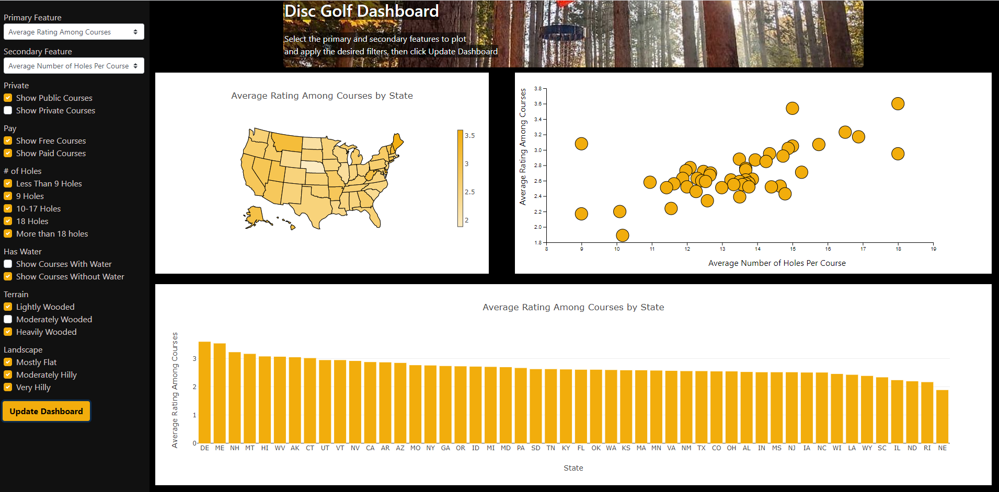

# The State of Disc Golf Dashboard

## Overview

With the popularity of disc golf exploding in 2020 and over 7000 disc golf courses around the nation, it begs the question, where can I go to have the best disc golf experience? Using this application, one will be able to determine, using their own preferences, where is the best place to play a round.

The overall goal of this project is to create a dashboard of visualizations with filter capabilities, giving users the ability to find the perfect area based on their preferences.

## Data Source
- [DG Course Review](https://www.dgcoursereview.com/) is a site that lists thousands of disc golf courses around the world. For this project, we'll be focusing on courses in the United States. Each course page lists many details including:
    - Course Name
    - Private or Public Status
    - Pay to Play Course
    - State
    - Holes
    - Presence of Water on a Course
    - Presence of Water at each Hole
    - Terrain (Lightly Wooded, Moderately Wooded, Heavily Wooded)
    - Landscape (Mostly Flat, Moderately Hilly, Very Hilly)
    - Rating
    - Reviews
    - Course Length
    

## Project Steps
1. Scrape each course page DG Course Review
2. Set-up MongoDB Atlas database
3. Create functions to aggregate data
4. Display aggregate data in the browser dashboard

## Tools and Languages
- MongoDB
    - MongoDB Atlas
    

- Python
    - Flask
    - Javascript
    - Beautiful Soup
    - Splinter
    - Pandas
    - Datetime
    - Time
- HTML
- CSS
  - Bootstrap
- JavaScript
  - D3
  - Plotly

- ## File Overview
  - ### index.html
    ##### *html framework for page*
  - ### DiscScape.ipynb
    ##### *jupyter notebook used for scraping [DG Course Review](https://www.dgcoursereview.com/)*
  - ### app.py
    ##### *application for running flask server and api*
  - ### main.js
    ##### *handles the filters and parameters selected on the sidebar, then calls the js files for the 3 plots*

- ## How to Use the Dashboard
    1. Select the Primary Feature using the sidebar, this will determine the y-values of the scatter plot, bar chart and the choropleth maps.
    2. Select the Secondary Feature using the sidebar, this will determine the x-values of the scatter plot.
    3. Use the Checkboxes in the sidebar to filter out types of courses that you aren't interested in. By default all boxes are checked, meaning that no courses are filtered out. If you are a beginner and don't want to lose discs, you may want to uncheck "Show Courses With Water".
    4. Click "Update Dashboard".
    5. Explore the visuals.
    6. Repeat!

- ## Conclusion
    - Overall, this project is a great showcase of multiple tools and languages including Python, Javascript, CSS, and HTML. Python was used to create the server, access the database, and provide the api endpoints. HTML and CSS were used to create the general page structure and styling.Javascript was used to create the graphs and manage feature selection and filtering. The dashboard offers users the ability to search multiple course features and apply multiple filters.
    
    
